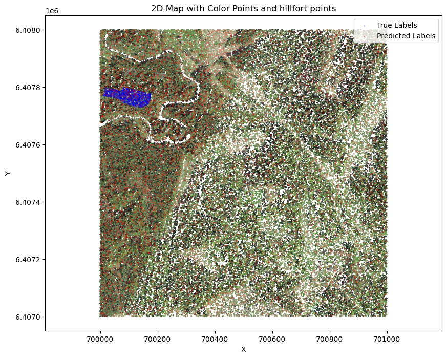
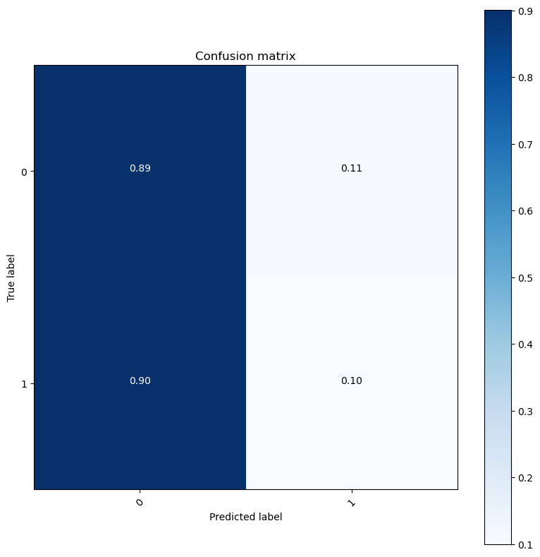
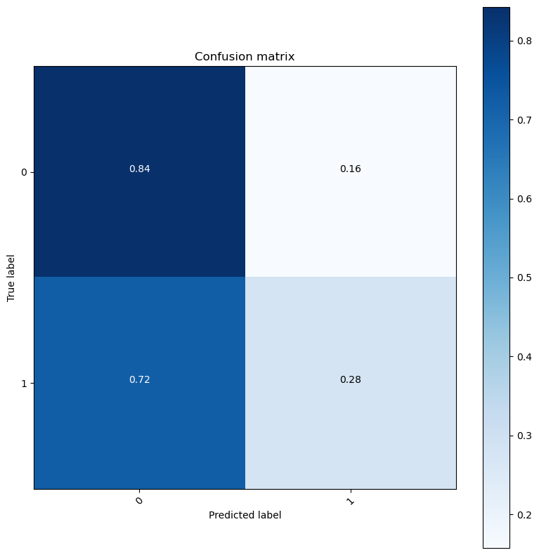

# Hillfort-detection-with-LiDAR-data

## Objective

Hillforts are crucial historical landmarks often challenging to detect due to overgrowth or terrain. Archaeologists manually search for them from terrain maps.

With this project, we want to provide the automated detection of hillforts using LiDAR data to assist archaeologists and historians in preserving cultural heritage.

## Structure

There are three main directories:
* [`data`](./data/) - for storing downloaded `.laz` files, hillfort data (folders *inspire* and *~~kpois~~*), normalized polygons [`normalized_polygons.csv`](./data/normalized_polygons.csv) and map numbers corresponding to 1:2000 scale map division [`linnamagede_ruudunumbrid.csv`](./data/linnamagede_ruudunumbrid.csv)
* [`model_weights`](./model_weights/) - for storing trained model weights
* [`notebooks`](./notebooks/) - the main of this project, showing the process of the data and the model

## Important notebooks

### [`data.ipynb`](./notebooks/data.ipynb): 

This notebook processes LiDAR data and associated hillfort polygon data to normalize, classify, and downsample point cloud data from LAS files.

* **Configurations**: Sets global bounding box values for normalization of LiDAR data acquired manually from [Land Board's Geoportal](https://geoportaal.maaamet.ee).

* **Gather Hillfort Data**: The notebook begins by gathering hillfort polygons and matching them to corresponding LiDAR LAS files based on geographic square numbers. It creates an optimized DataFrame linking each LAS file with the relevant polygons.

* **Normalize LiDAR Data and Polygons**: The `normalize_lidar_and_polygons()` function normalizes the LiDAR data based on global bounding box values. It also normalizes the associated polygons to ensure alignment with the normalized LiDAR data.

* **Classify Points within Polygons**: The `classify_points_in_multiple_areas()` function assigns a new classification to LiDAR points within hillfort polygons. The `mark_polygons_in_las()` function applies this classification to all LiDAR files.

* **Downsample LiDAR Data**: The `downsample_lidar()` function reduces the LiDAR dataset's size by applying a grid-based downsampling method, ensuring efficiency in large-scale analyses. For example, $3004416 \text{ points} \rightarrow 59579 \text { points}$

### [`model.ipynb`](./notebooks/model.ipynb)

This notebook demonstrates the implementation and training of a PointNet model to classify LiDAR point cloud data, specifically to differentiate between Hillfort and Non-Hillfort classes. The model setup is based on [Nikita Karaev's implementation of PointNet](https://colab.research.google.com/github/nikitakaraevv/pointnet/blob/master/nbs/PointNetClass.ipynb#scrollTo=ZV20opgrv23I)[^1], with customized loss criteria to handle class imbalance.

**Model Architecture**

* **Tnet** (Transformation Network): A small neural network that learns a transformation matrix for input point clouds and features to align them for better classification.
* **Transform**: This module applies the learned input transformation and feature transformation on the point clouds.
* **PointNet**: The core network that processes the transformed point clouds using 1D convolutions and fully connected layers to output class probabilities.

**Data Pipeline**

* **PointCloudDataset**: A custom Dataset class to handle LiDAR point cloud data, with support for padding or truncating point clouds to ensure a consistent number of points (1024).
* **Data Splits**: The dataset is split into training, validation, and test sets (70%, 10%, 20%) from .laz files, which are loaded using the laspy library.

**Loss Function**

* A custom loss function `pointnetloss` combines the standard negative log-likelihood loss (NLL) with regularization terms to penalize deviations in the learned transformation matrices. Regularization is applied to both input and feature transformation matrices with small weights.

**Training & Evaluation**

* **Training**: The model is trained using the Adam optimizer and a custom criterion with class weights to handle the class imbalance (Hillforts are the minority class). A dropout layer is included in the network to prevent overfitting.

* **Evaluation**: After training, the model is evaluated on the test set, and performance metrics such as accuracy and a confusion matrix are computed. The model weights are saved after every epoch for potential recovery and evaluation.

**Hyperparameters and Training Configuration**

* **Batch Size**: 128
* **Learning Rate**: 0.001
* **Epochs**: 6
* **Dropout Rate**: 0.3
* **Class Weights**: Computed using sklearn.utils.class_weight.compute_class_weight to balance the loss function.

**Usage**

* **Prepare Data:** LiDAR .laz files must be organized in a directory. The prepare_X_and_y() function loads and preprocesses the data.
* **Initialize and Train**: The model is initialized, and training can be run using the train() function.
* **Save & Load Weights**: Model weights are saved at the end of each epoch. The model can be loaded with the saved weights to resume training or for inference.

## Results

Training on downsampled data took 800 minutes = 13 hours and 40 minutes. Each epoch took about 2 hours and 40 minutes to train and evaluate.

### Single map

The classifier has a high rate of correctly identifying non-hillfort points 89%, but poor performance when identifying hillforts, with only 10% of true hillfort points being correctly classified. The model has many false negatives 90%, meaning it misses most of the hillfort points.

### Overall

On the overall lidar data we had, the classifier could correctly classify 28% of true hillfort points and 84% of true non-hillfort points. The model still has many false negatives 72%, but there are not much 16% false positives.

The classifier performs well on non-hillfort points but struggles significantly with hillfort classification. The high false negative rate suggests that the model may require further refinement, including potential adjustments to data processing (like downsampling), model architecture, hyperparameters, or longer training durations.

[^1]: Qi, Charles R and Su, Hao and Mo, Kaichun and Guibas, Leonidas J. PointNet: Deep Learning on Point Sets for 3D Classification and Segmentation. [arXiv:1612.00593](https://arxiv.org/abs/1612.00593). 2016. [GitHub](https://github.com/charlesq34/pointnet)
